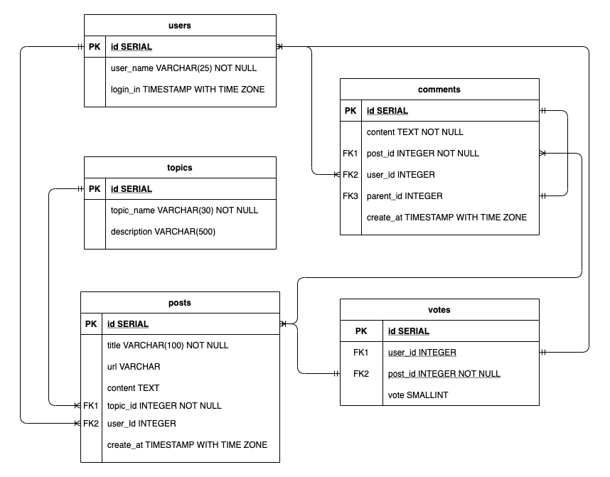

# Udiddit, a social news aggregator
## Introduction About Udiddit

Udiddit is a social news aggregator, content rating, and discussions website. On Udiddit, registered users are able to link to external content or post their own text content about various topics, ranging from common topics such as photography and food, to more arcane ones such as horse masks or birds with arms. In turn, other users can comment on these posts, and each user is allowed to cast a vote about each post, either in an up (like) or down (dislike) direction.

Unfortunately, due to some time constraints before the initial launch of the site, the data model stored in Postgres hasn’t been well thought out, and is starting to show its flaws. So here comes the tasks for this project.

> First, to make an assessment of the situation and take steps to fix all the issues with the current data model.

> Second, to improve the current system by making it more robust and initiating some query plans for analytics.


The new schema should allow posts to be created by registered users on certain topics, and can include a URL or a text content. It should also allow registered users to cast an upvote (like) or downvote (dislike) for any forum post that has been created. In addition to this, the schema needs also allow registered users to add comments on posts.

Here is the DDL used to create the orginal (bad) schema:

 ```sql
 CREATE TABLE bad_posts (
 	id SERIAL PRIMARY KEY,
 	topic VARCHAR(50),
 	username VARCHAR(50),
 	title VARCHAR(150),
 	url VARCHAR(4000) DEFAULT NULL,
 	text_content TEXT DEFAULT NULL,
 	upvotes TEXT,
 	downvotes TEXT
 );
 
 CREATE TABLE bad_comments (
 	id SERIAL PRIMARY KEY,
 	username VARCHAR(50),
 	post_id BIGINT,
 	text_content TEXT
 );
 ```

You can find the complete codes and data in `bad-db.sql` file.

## Steps to Go

This project was based on the following three main steps:

### Step I: Investigate the existing schema

The current schema has been investigated and some of specific improvements to be made has been pointed out in this step.

### Step II. Create the DDL for your new schema

Based on the initial investigation and assessment, DDL for the creation of new schema has been applied in this step. Of course there are some requirements for designing the new schema which have been listed in the coming section.

### Step III. Migrate the provided data
Once the new schema is created, it’s time to migrate the data from the provided schema. Some guidelines have also been listed in the following section.

## Requirements for New Database Schema Design
### Guideline I - About creating tables

Here is a list of features and specifications that Udiddit needs in order to support its website and administrative interface:

a. Allow new users to register:
- Each username has to be unique
- Usernames can be composed of at most 25 characters
- Usernames can’t be empty
- We won’t worry about user passwords for this project

b. Allow registered users to create new topics:
- Topic names have to be unique.
- The topic’s name is at most 30 characters
- The topic’s name can’t be empty
- Topics can have an optional description of at most 500 characters.

c. Allow registered users to create new posts on existing topics:
- Posts have a required title of *at most 100 characters*
- The title of a post *can’t be empty*.
- Posts should contain either a *URL* or a *text content*, **but not both**.
- If a topic gets deleted, all the posts associated with it should be automatically deleted too.
- If the user who created the post gets deleted, then the post will remain, but it will become dissociated from that user.

d. Allow registered users to comment on existing posts:
- A comment’s text content can’t be empty.
- Contrary to the current linear comments, the new structure should allow comment threads at arbitrary levels.
- If a post gets deleted, all comments associated with it should be automatically deleted too.
- If the user who created the comment gets deleted, then the comment will remain, but it will become dissociated from that user.
- If a comment gets deleted, then all its descendants in the thread structure should be automatically deleted too.

e. Make sure that a given user can only vote once on a given post:
- (**Hint**) We can store the (up/down) value of the vote as the values 1 and -1 respectively.
- If the user who cast a vote gets deleted, then all their votes will remain, but will become dissociated from the user.
- If a post gets deleted, then all the votes for that post should be automatically deleted too.

### Guideline II - About the queries
Here is a list of queries that Udiddit needs in order to support its website and administrative interface. They are provided only to guide the design of new database schema.
- List all users who haven’t logged in in the last year.
- List all users who haven’t created any post.
- Find a user by their username.
- List all topics that don’t have any posts.
- Find a topic by its name.
- List the latest 20 posts for a given topic.
- List the latest 20 posts made by a given user.
- Find all posts that link to a specific URL, for moderation purposes. 
- List all the top-level comments (those that don’t have a parent comment) for a given post.
- List all the direct children of a parent comment.
- List the latest 20 comments made by a given user.
- Compute the score of a post, defined as the difference between the number of upvotes and the number of downvotes

### Guideline III
Database **normalization**, various **constraints**, as well as **indexes** have been used in the new database schema. ___Named constraints___ and ___indexes___ are also used to make the schema read cleaner and more easily.

### Guideline IV
**Five (5)** tables composed this new schema with an auto-incrementing id as their primary key.

The ERD for the new schema:




After executing the DDL in the `udiddit_social_news_aggregator.sql`, we can get five new tables as follows,


## Requirements for Data Migration into New Schema
1. Topic descriptions can all be empty
2. Since the bad_comments table doesn’t have the threading feature, you can migrate all comments as **top-level** comments, i.e. without a parent
3. Postgres string function `regexp_split_to_table` can be used to unwind the comma-separated votes values into separate rows
4. Some users only vote or comment, and haven’t created any posts. Those users need to be created too.
5. The order of migrations matters! For example, since posts depend on users and topics, which need to be migrated first.
6. Tip: We can start by running only `SELECT`s to fine-tune your queries, and use a `LIMIT` to avoid large data sets. Once we know we have the correct query, we can then run our full `INSERT...SELECT` query.


## How to Use the Codes
There are two files included under the folder called `bad-db.sql` and `udiddit_social_news_aggregator.sql`.

Firstly, running the `bad-db.sql` in the possgres terminal, we can create the original (bad) database schema as well as importing the data.

Secondly, running the codes in the `udiddit_social_news_aggregator.sql` block by block, we can reconstruct the normalized (new) database schema and migrate the data respectively.

 